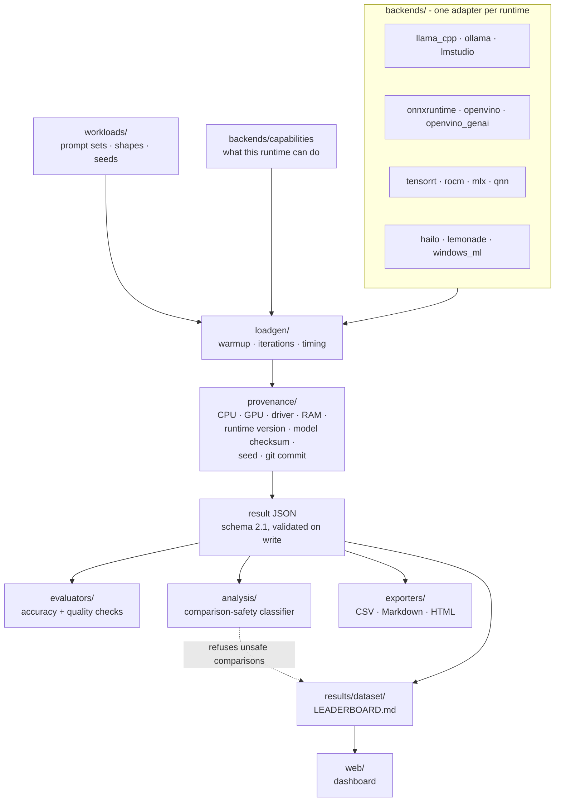

# AIHWBench — Local AI Hardware Benchmark for LLMs on CPU, GPU and NPU

<!-- badges -->
[](https://github.com/webdevsamran/local-ai-hardware-bench/actions/workflows/ci.yml)
[](https://github.com/webdevsamran/local-ai-hardware-bench/actions/workflows/codeql.yml)
[](https://github.com/webdevsamran/local-ai-hardware-bench/releases)
[](https://github.com/webdevsamran/local-ai-hardware-bench/blob/main/LICENSE)
[](pyproject.toml)
[](pyproject.toml)
<!-- /badges -->

**Measure how fast a local LLM actually runs on your own machine — tokens per
second, time to first token, VRAM use and watts — then find out whether your
number can honestly be compared to anyone else's.**

AIHWBench is a vendor-neutral, reproducible **local AI benchmark** for
llama.cpp, Ollama, ONNX Runtime, OpenVINO, LM Studio, vLLM and fifteen more
runtimes — 21 backends in all — across consumer GPUs, CPUs, integrated
graphics, **NPUs in AI PCs**, workstations, mini PCs and edge accelerators. It runs offline, publishes the
raw data, and refuses to print a comparison it cannot justify.

> Created and maintained by **[@webdevsamran](https://github.com/webdevsamran)**
> (Original Creator · Founder · Lead Maintainer), with contributions from the
> open-source community. **[Sponsor this project](#sponsor-this-project)** ·
> **[Lend hardware](docs/hardware-needed.md)** · **[Credits](CREDITS.md)**

**[Live dashboard and leaderboard →](https://webdevsamran.github.io/local-ai-hardware-bench/)**

---

## Contents

- [What AIHWBench answers](#what-aihwbench-answers)
- [Install and run your first benchmark](#install-and-run-your-first-benchmark)
- [How it compares to MLPerf Client, LocalScore and llama-bench](#how-it-compares-to-mlperf-client-localscore-and-llama-bench)
- [What has actually been measured](#what-has-actually-been-measured)
- [Supported runtimes and hardware](#supported-runtimes-and-hardware)
- [Metrics captured](#metrics-captured)
- [Comparison safety — the part nobody else does](#comparison-safety--the-part-nobody-else-does)
- [Guides](#guides)
- [Frequently asked questions](#frequently-asked-questions)
- [Advanced workflows](#advanced-workflows)
- [How a benchmark run is put together](#how-a-benchmark-run-is-put-together)
- [Contributing](#contributing) · [Sponsor this project](#sponsor-this-project) · [Credits](#credits-and-acknowledgements)

## What AIHWBench answers

These are the questions people actually type into a search box before buying a
graphics card or deploying a model. Each one links to a measured answer, not an
estimate:

| Question | Answer |
| --- | --- |
| **How many tokens per second will this model get on my GPU?** | [Run one benchmark](#install-and-run-your-first-benchmark), or browse the [leaderboard](https://webdevsamran.github.io/local-ai-hardware-bench/leaderboard) |
| **How much VRAM do I need to run a 7B, 13B or 70B LLM?** | [Will it run on my PC?](https://webdevsamran.github.io/local-ai-hardware-bench/will-it-run) and `aihwbench fit` |
| **What happens when the model does not fit in VRAM?** | [The offload cliff, measured](docs/results/offload-cliff-rtx3080ti.md) — **39.6% lost in one step**, 5.8× end to end |
| **Does KV-cache quantization make inference faster?** | [No — it is a memory feature](docs/results/kv-cache-rtx3080ti.md). Nine configurations measured; two cost more than they save |
| **Is a q4 quant actually worth it over q8?** | `aihwbench quantization` — and it [refuses to rank speed without a quality column](docs/methodology.md) |
| **Is local inference cheaper than a cloud API?** | [Local vs cloud cost calculator](https://webdevsamran.github.io/local-ai-hardware-bench/local-vs-cloud), using measured watts |
| **Which configuration is best on *my* machine?** | `aihwbench tune` and `aihwbench recommend`, with the evidence attached |
| **Why do two benchmarks of the same GPU disagree?** | [Comparison safety](#comparison-safety--the-part-nobody-else-does) — usually they were never comparable |

## Install and run your first benchmark

Requires Python 3.10 or newer. Works on Windows, Linux and macOS.

```bash
git clone https://github.com/webdevsamran/local-ai-hardware-bench.git
cd local-ai-hardware-bench
pip install -e ".[dev]"
```

Optional but recommended for richer telemetry: `pip install psutil`.

```bash
# 1. What hardware and runtimes do I have? Any problems?
aihwbench doctor

# 2. Which runtimes are usable right now?
aihwbench runtimes

# 3. Benchmark a real model (pull it first)
ollama pull qwen2.5:0.5b-instruct-q4_K_M
aihwbench benchmark --runtime ollama --model qwen2.5:0.5b-instruct-q4_K_M

# 4. Check the environment noise around that number
aihwbench self-test
```

A run takes a couple of minutes and writes a validated JSON document containing
every number *and* the conditions that produced it. Nothing leaves your machine
unless you choose to submit it.

### Benchmark llama.cpp directly

```bash
aihwbench benchmark --runtime llama.cpp \
    --model-path path/to/model-q4_k_m.gguf \
    --device cuda
```

`--device` selects the accelerator; the requested device is recorded in the
result, and the backend refuses rather than silently falling back to a CPU
under an accelerator's name.

## How it compares to MLPerf Client, LocalScore and llama-bench

| | AIHWBench | MLPerf Client | LocalScore | llama-bench |
| --- | --- | --- | --- | --- |
| Your hardware, your model | **Yes** | Approved list only | Official models | Yes |
| Consumer + edge + NPU | **Yes** | AI PC only | Consumer GPU | Any llama.cpp target |
| Public raw dataset | **Yes** | Summary scores | Yes, composite score | No |
| Says when two results are **not** comparable | **Yes** | No | No | No |
| Energy, thermals, performance per watt | **Yes** | No | No | No |
| Measures the HTTP serving path a user feels | **Yes** | No | Partly | No — in-process only |
| Refuses to publish an unlabelled single run | **Yes** | n/a | No | No |

> MLPerf Client certifies approved models on approved hardware. Bench360
> measures serving engines on datacentre GPUs. LocalScore gives you one number.
> **AIHWBench measures any backend on the hardware you actually own, publishes
> the raw data, and tells you when two numbers cannot honestly be compared.**

Nine projects are tracked in
[`docs/competitive-analysis.md`](docs/competitive-analysis.md), regenerated from
the GitHub API rather than hand-maintained, and committed to
[`data/competitor-meta.json`](data/competitor-meta.json).

## What has actually been measured

Results are only claimed for machines where benchmarks genuinely ran. There are
currently **9 published results** in [`results/published/`](results/published),
all from one reference machine — which is exactly why more hardware is the
project's single biggest need.

| Platform | CPU | GPU | RAM | Status |
| --- | --- | --- | --- | --- |
| Acer Predator PT516-52s | Intel Core i9-12900H | NVIDIA RTX 3080 Ti Laptop (16 GB) | 32 GB | **Tested** |

Three measured studies you can read without installing anything:

- **[The offload cliff](docs/results/offload-cliff-rtx3080ti.md)** — throughput
  against GPU layers. Generation runs **64.4 tok/s on CPU and 371.9 tok/s fully
  offloaded**, but the curve is not smooth: one adjacent step costs 39.6%, and
  `-ngl 24` on a 24-block model is *not* full offload.
- **[KV-cache quantization](docs/results/kv-cache-rtx3080ti.md)** — nine K/V
  dtype combinations at 32K context. `q4_0` for both caches cuts the cache
  71.9% with no measurable throughput cost; every asymmetric configuration is
  worse than both symmetric ones around it.
- **[Three devices, one model](docs/results/openvino-three-devices.md)** — CPU,
  integrated GPU and discrete GPU running the same OpenVINO IR, including the
  device where greedy decoding did not reproduce.

See [docs/compatibility-matrix.md](docs/compatibility-matrix.md) for the full
runtime × platform matrix, including what is *not* tested yet.

## Supported runtimes and hardware

"Tested" means a real benchmark executed on the reference machine and a
validated result file exists in [`results/published/`](results/published).

| Runtime | Detection | Benchmarking |
| --- | --- | --- |
| Ollama (CUDA) | Yes | **Yes — tested** |
| llama.cpp (`llama-server`, CUDA) | Yes | **Yes — tested** |
| ONNX Runtime (CPU + DirectML EPs) | Yes | **Yes — tested** |
| OpenVINO (CPU + GPU devices) | Yes | **Yes — tested** |
| OpenVINO GenAI (LLM pipeline, CPU/iGPU/dGPU) | Yes | **Yes — measured**; not published, the machine was contended ([study](docs/results/openvino-three-devices.md)) |
| NVIDIA CUDA | Yes | **Yes — tested** (via Ollama/llama.cpp CUDA builds) |
| NVIDIA TensorRT | Yes | **Backend written**, needs an NVIDIA box to verify (engine built on the benchmarking machine) |
| AMD ROCm / Ryzen AI / Lemonade | Yes | **Backends written**, need an AMD system to verify |
| Qualcomm QNN | Yes | **Backend written**, needs a Snapdragon X to verify |
| Hailo HailoRT | Yes | **Backend written**, needs a Hailo device and a compiled `.hef` |
| LM Studio (OpenAI-compatible server) | Yes | **Yes — experimental** (HTTP API backend) |
| vLLM (OpenAI-compatible server) | Yes | Supported (Linux + NVIDIA/ROCm; not runnable on the reference machine) |
| SGLang (OpenAI-compatible server) | Yes | Supported (Linux + NVIDIA/ROCm; not runnable on the reference machine) |
| Apple MLX | Yes | **Backend written**, needs Apple Silicon to verify |
| Windows ML / DirectML | Yes | **Yes — tested** (ONNX Runtime DML EP) |

Runtimes that cannot run on current hardware report an explicit
`HARDWARE_REQUIRED` status instead of pretending.

**"Backend written" means the code path is complete and unit-tested, and has
never run on the silicon it targets** — no AMD, Snapdragon, Hailo or Apple
machine has been available here. Each one detects its runtime, refuses rather
than falling back to a CPU under an accelerator's name, and produces a result
through the same measurement path every published number here came from. If you
have one of these machines, `aihwbench doctor` then `aihwbench benchmark
--runtime <name>` is the whole of it; a failure is a bug report with a stack
trace, which is nearly as useful as a result. See
[docs/hardware-needed.md](docs/hardware-needed.md).

## Metrics captured

| Metric | Source | Notes |
| --- | --- | --- |
| Model load time | measured | where the runtime exposes it |
| Time to first token (TTFT) | measured | first streamed token |
| Prompt processing tok/s | measured | runtime-reported counts/durations |
| Generation tok/s | measured | runtime-reported counts/durations |
| Inter-token latency p50/p90/p99 | measured | a distribution, not a mean |
| Latency mean/p50/p75/p90/p95/p99/p99.9, stddev, CV | measured | across iterations |
| Peak RAM / VRAM | sampled | background telemetry thread |
| CPU/GPU/NPU utilization | sampled | `psutil` / `nvidia-smi` / OS NPU counters |
| Temperature, power draw | sampled | `nvidia-smi`; null elsewhere |
| Energy per token, tokens per kWh | derived | from sampled power over the measured window |
| Performance per watt | derived | throughput ÷ average watts — **tok/s/W** for generative runtimes, **inf/s/W** for graph/vision runtimes. Published results carry the unit; the two are not comparable |

**Metrics that cannot be measured reliably are reported as `null` and shown as
"not measured" in reports. They are never estimated.** A zero and an unmeasured
value are different things, and this project keeps them different all the way to
the dashboard.

## Comparison safety — the part nobody else does

Two tokens-per-second numbers are only meaningful together if the things that
move them were the same. AIHWBench classifies every comparison explicitly and
returns machine-readable reasons:

- **`STRICTLY_COMPARABLE`** — model checksum, format, quantization and
  tokenizer, prompt, token budget, sampling settings, seed, context length,
  batch/concurrency, warmups/iterations, runtime, backend and device all match.
- **`CONDITIONALLY_COMPARABLE`** — the workload matches but caveats exist
  (power profile, OS version, runtime version).
- **`NOT_COMPARABLE`** — a direct metric comparison would mislead. The CLI
  refuses to emit deltas unless you pass `--force`, and `aihwbench compare`
  exits with code **3**.
- **`INSUFFICIENT_METADATA`** — the fields needed to decide are absent. Missing
  on both sides is treated as *unknown*, never as agreement.

That last rule exists because the obvious implementation gets it backwards: two
results that both omit a field look identical to a naive comparison. The
leaderboard groups by comparability rather than footnoting it, so an
incomparable row can never be read as a ranking.

Full rules, field by field, with the reason each one is there:
[docs/comparability-rubric.md](docs/comparability-rubric.md) and
[docs/methodology.md](docs/methodology.md).

### Result trust states

Results carry a machine-readable trust state consumed by the dataset pipeline
and the dashboard badges (see
[submission pipeline](docs/results/submission-pipeline.md) and
`aihwbench/quality.py`):

| State | Meaning |
| --- | --- |
| `verified` | Executed/reproduced by the project on real hardware |
| `community_validated` | Independently reproduced by a community member |
| `unreviewed` | Default for new submissions pending review |
| `flagged` | Statistically anomalous; queued for human review — never auto-rejected |
| `invalidated` | Superseded with a recorded reason; original history is preserved |
| `superseded` | Replaced by a referenced replacement result |

Bad history is never silently deleted: invalidation records keep the original
document verbatim with a reason and a replacement reference.

## Guides

Written for people searching for the problem, not for the tool:

| Guide | What it answers |
| --- | --- |
| [How to benchmark a local LLM](docs/guides/how-to-benchmark-a-local-llm.md) | The whole process end to end, and the five mistakes that make a number meaningless |
| [Tokens per second, explained](docs/guides/tokens-per-second-explained.md) | What tok/s, TTFT and inter-token latency actually mean, and which one you feel |
| [How much VRAM do I need?](docs/guides/vram-requirements-for-local-llms.md) | Model size × quantization × context, and what happens when it does not fit |
| [NPU vs GPU vs CPU for local AI](docs/guides/npu-vs-gpu-for-local-ai.md) | What an NPU in an AI PC is good at, and what it is not |
| [Choosing a quantization](docs/guides/choosing-a-quantization.md) | q4 vs q5 vs q8 vs FP16 — speed, memory, and the quality column people omit |
| [Benchmark your hardware](docs/contributing/benchmarking-your-hardware.md) | Contribute a result from your own machine |

## Frequently asked questions

### How many tokens per second do I need for a local LLM?

For reading generated text as it streams, roughly **7–10 tok/s** keeps pace with
a fast reader, and 20+ feels instant. For code completion or anything agentic,
what matters more is **time to first token** — a 200 ms TTFT at 30 tok/s feels
faster than a 2 s TTFT at 80 tok/s. That is why this project reports both
separately and refuses to collapse them into a single score.

### How much VRAM do I need to run a 7B model?

A 7B model at q4_K_M needs roughly 4.5 GB for weights, plus a KV cache that
grows with context — so 6 GB is tight and 8 GB is comfortable at short context.
Use `aihwbench fit --parameters 7B --quantization q4_k_m` for an estimate,
clearly labelled as an estimate, or the
[Will it run?](https://webdevsamran.github.io/local-ai-hardware-bench/will-it-run)
page, which also shows measured results for that configuration where they exist.

### What happens if a model does not fit in VRAM?

Throughput falls off a step, not a slope. On the reference machine, moving from
18 to 24 offloaded layers changed generation by **39.6%** for 66 MB of VRAM, and
the full curve spans **5.8×**. Where the step sits depends on PCIe generation,
memory bandwidth and what else is using the card, which is why it has to be
measured per machine:
[the offload cliff](docs/results/offload-cliff-rtx3080ti.md).

### Does KV-cache quantization speed up inference?

No. It is a **memory** feature. Measured across nine K/V dtype combinations,
`q4_0` for both caches cut cache memory by 71.9% with a throughput difference
inside the noise floor — while two asymmetric configurations cost over 60% of
throughput for less memory saved:
[KV-cache quantization](docs/results/kv-cache-rtx3080ti.md).

### Is an NPU faster than a GPU for running LLMs?

For LLM token generation on a machine that also has a discrete GPU, generally
no — NPUs are built for sustained low-power inference, not peak memory
bandwidth, and token generation is bandwidth-bound. Where an NPU wins is
**performance per watt**, and leaving the GPU free for something else.
AIHWBench samples NPU utilisation where the operating system exposes counters,
so the claim can be checked rather than argued:
[NPU vs GPU vs CPU](docs/guides/npu-vs-gpu-for-local-ai.md).

### Why do two benchmarks of the same GPU disagree?

Usually because they were never comparable: a different quantization, a
different context length, a different runtime build, a laptop on battery rather
than plugged in, or a background process competing for the same silicon. This
project treats that as the central problem rather than a caveat — see
[comparison safety](#comparison-safety--the-part-nobody-else-does). During
development of this repository, a 15% difference between two devices turned out
to be background CPU contention, which is precisely the failure mode the
classifier exists to catch.

### Does AIHWBench send my data anywhere?

No. It runs entirely offline. Detection output is sanitized — no serial numbers,
MAC addresses, usernames, home paths, cloud access keys or network identifiers —
and every published artifact passes a fail-closed privacy scan before it can be
committed. Submitting a result is an explicit, separate action. See
[SECURITY.md](SECURITY.md) and [docs/security/privacy.md](docs/security/privacy.md).

### Can I publish a benchmark from my own machine?

Yes, and it is the most useful thing you can contribute. Run the benchmark, then
validate and bundle the result and open a pull request — CI checks the schema,
the privacy scan and the integrity hashes automatically. See
[docs/contributing/benchmarking-your-hardware.md](docs/contributing/benchmarking-your-hardware.md).

### Is it free? What is the licence?

Apache-2.0, permanently, for the entire benchmarking core. See
[SUSTAINABILITY.md](SUSTAINABILITY.md) for how the project intends to fund
maintenance without crippling the open-source core, and
[Sponsor this project](#sponsor-this-project) below.

## Dashboard

The [web/](web) directory contains a production React + TypeScript dashboard
deployed to GitHub Pages, generated exclusively from the published dataset — no
synthetic numbers. Every route is prerendered to real HTML with its own title,
description, canonical URL and JSON-LD, so it is indexable without executing
JavaScript.

- global leaderboard (throughput / TTFT / perf-per-watt views), grouped by
  comparison safety rather than ranked blindly,
- hardware, runtime, model and result explorers with URL-shareable filters,
- interactive tools: will-it-run, local-vs-cloud cost, efficiency frontiers,
  offload-cliff explorer, configuration recommender,
- result comparison, compatibility matrix, methodology and docs pages,
- downloadable JSON per result and a read-only dataset API.

Regenerate its data locally with `python scripts/generate_frontend_data.py`; CI
fails if the committed generated data drifts from `results/published/`. Measured
Lighthouse and axe-core results, with the conditions they were taken under, are
in [docs/research/dashboard-performance.md](docs/research/dashboard-performance.md).

## Advanced workflows

```bash
# Parameter sweep producing a structured matrix (JSON + CSV)
aihwbench sweep --runtime ollama --model <tag> --context-list 1024,2048,4096

# KV-cache dtype matrix: how much context fits, not how fast it runs
aihwbench sweep --runtime llama.cpp --model-path model.gguf   --cache-type-k-list f16,q8_0,q4_0 --cache-type-v-list f16,q8_0,q4_0   --context-list 32768 --output-name sweep-llama.cpp-kvcache
aihwbench kv-cache results/sweeps/sweep-llama.cpp-kvcache.json   --model-path model.gguf

# What was benchmarked: licence, checksum, and how to obtain it
aihwbench zoo list
aihwbench zoo verify
aihwbench zoo fetch qwen2.5-0.5b-instruct-q4_k_m

# Declarative experiment manifest (JSON/TOML/YAML)
aihwbench run experiments/my-experiment.json

# Concurrency ladder: req/s, p95/p99 latency, sustainable concurrency
aihwbench capacity --runtime ollama --model <tag> --levels 1,2,4,8

# Auto-tune threads/batch/context/GPU layers; Pareto-optimal configs
aihwbench tune --runtime llama.cpp --model-path model.gguf --threads-list 4,8,12

# Bottleneck analysis from measured telemetry
aihwbench analyze results/raw/<run_id>.json

# Model memory-fit estimate (clearly labeled as an estimate)
aihwbench fit --parameters 7B --quantization q4_k_m

# Configuration recommendation for this machine, with evidence
aihwbench recommend

# Quantization variant comparison across published results
aihwbench quantization --results-dir results/published

# Portable .aihwbench bundle with SHA-256 integrity; verify it later
aihwbench bundle results/raw/<run_id>.json
aihwbench verify-bundle <bundle>.aihwbench

# Comparability and reproduction checks
aihwbench env-diff <a>.json <b>.json
aihwbench reproduce results/raw/<run_id>.json --check-environment

# Data quality, invalidation (history preserved), anomaly review
aihwbench quality results/published
aihwbench invalidate <result.json> --reason "wrong clock source"
aihwbench anomalies --results-dir results/published

# Versioned dataset snapshot manifests
aihwbench snapshot --version v1 --results-dir results/published

# Quality evaluation over a JSONL responses file (evaluator plugins)
aihwbench evaluators                      # exact_match, rouge_l, token_f1, ...
aihwbench evaluate --evaluator rouge_l --dataset responses.jsonl

# Multiple choice (MMLU-shaped sets). The dataset is yours; this scores it,
# and reports an answer it cannot read as unknown rather than as wrong.
aihwbench evaluate --evaluator multiple_choice --dataset mmlu-subset.jsonl

# Export via the exporter plugin API (json/csv/markdown/sqlite built-in)
aihwbench export-as --format csv --results-dir results/published --output out.csv

# Generate dataset views from published results
aihwbench export results/published --output results/dataset

# Validate and report on any result file
aihwbench validate results/raw/<run_id>.json
aihwbench report results/raw/<run_id>.json

# Compare two runs (refuses to compare incompatible workloads)
aihwbench compare results/raw/<a>.json results/raw/<b>.json

# Or run a versioned suite profile
aihwbench suite smoke --runtime ollama --model qwen2.5:0.5b-instruct-q4_K_M

# Full detection dump (JSON)
aihwbench detect
```

## How a benchmark run is put together

One loadgen drives every backend, so a number from ONNX Runtime and a number
from llama.cpp were produced by the same measurement code and differ only in
what they measured. Provenance is captured at run time, not written down
afterwards: CPU, cores, GPU and VRAM, driver, RAM, runtime version, model
checksum, seed, warmup and iteration counts and the git commit all land in the
result document. Boxes are real modules under [`aihwbench/`](aihwbench):

<!-- mermaid:architecture -->

<!-- /mermaid:architecture -->

## Result format & schema

Every result is a JSON document validated on write:

- Formal JSON Schema: [`schemas/result-1.0.schema.json`](schemas/result-1.0.schema.json) and
  [`schemas/result-2.0.schema.json`](schemas/result-2.0.schema.json)
- Semantic validator: [`aihwbench/schemas.py`](aihwbench/schemas.py)
- Full field reference: [`schemas/README.md`](schemas/README.md)

Validation covers types, ISO-8601 UTC timestamps, run-id format, non-negative
metrics, utilisation ranges (0–100), and reproducibility typing. Passing
`--formal` to the validate command additionally checks the document against the
published JSON Schema.

## Python SDK & plugins

Typed public APIs live in `aihwbench/sdk.py`: `BenchmarkResult`, `SystemInfo`,
`RuntimeInfo`, `ModelInfo`, `MetricSet`, `Workload`, `BenchmarkRunner`,
`RegressionReport`. All convert losslessly from published result documents;
unavailable metrics stay `None`.

Plugin entry points:

| Group | Purpose |
| --- | --- |
| `aihwbench.workloads` | third-party workload definitions |
| `aihwbench.evaluators` | quality evaluators |
| `aihwbench.exporters` | export formats (JSON/CSV/Markdown/SQLite built in; Parquet behind an extra) |

## Automation & CI

Exit codes are a stable contract (`aihwbench/exit_codes.py`):

| Code | Meaning |
| --- | --- |
| 0 | success |
| 1 | validation/data error |
| 2 | usage/backend error |
| 3 | results NOT_COMPARABLE |
| 4 | configuration error |
| 5 | performance regression detected (regression gate) |

A CI regression gate that cannot compare two results **fails** rather than
passing silently — that is what code 3 is for.

## Reproducing a published result

Each committed result in [`results/published/`](results/published) includes a
`reproducibility` block: exact prompt, sampling parameters, context length,
warm-up/iteration policy, model checksum, runtime version, driver versions,
power profile, and the exact command to re-run it.

Tooling support:

- `aihwbench env-diff A B` — field-by-field comparability report;
- `aihwbench reproduce <result.json>` — prerequisite and deviation check;
- `aihwbench repro-score <result.json>` — transparent metadata-completeness
  score (explicitly **not** a scientific-validity claim);
- `aihwbench bundle` / `verify-bundle` — portable `.aihwbench` archives with
  SHA-256 integrity over every member;
- provenance hashing (`aihwbench/provenance/`) covers result, environment,
  workload and model identity; optional cosign signing interfaces are thin
  wrappers that honestly report when cosign is unavailable.

## Contributing

We welcome code, backends, hardware results, documentation, and reviews. The
highest-value contribution is **a benchmark from hardware nobody here owns**.

Start with [CONTRIBUTING.md](CONTRIBUTING.md). Good first issues are labeled in
the issue tracker. See also:

- [Backend plugin API](docs/guides/plugin-api.md)
- [Result submission pipeline](docs/results/submission-pipeline.md)
- [Governance](GOVERNANCE.md) · [Code of Conduct](CODE_OF_CONDUCT.md)

## Sponsor this project

AIHWBench is built and maintained in the open, under Apache-2.0, with no company
behind it. The benchmarking core will stay free permanently — see
[SUSTAINABILITY.md](SUSTAINABILITY.md) for exactly what that promise covers.

There are four ways to help, in rough order of how much they would change the
project:

1. **Lend or donate hardware.** This is the bottleneck. Nine published results
   all come from one laptop. An AMD system, a Snapdragon X machine, an Apple
   Silicon Mac, an Intel Core Ultra AI PC with an NPU, or any mini PC or SBC
   would each unlock a backend that is written, unit-tested and has never
   executed on the silicon it targets. See
   [docs/hardware-needed.md](docs/hardware-needed.md) and
   [docs/vendor-collaboration.md](docs/vendor-collaboration.md).
2. **Sponsor maintenance time** via
   [GitHub Sponsors](https://github.com/sponsors/webdevsamran) — see
   [`.github/FUNDING.yml`](.github/FUNDING.yml). Funded time goes to correctness
   first, hardware coverage second, features third.
3. **Fund a specific backend or study.** Vendor-funded work is disclosed in the
   pull request and the release notes, and buys no editorial control over
   results. Negative results are published like any other result.
4. **Run one benchmark and send it.** It costs you five minutes and is worth
   more to the dataset than most code contributions.

**What sponsorship does not buy:** favourable results, removal of a published
number, exclusion of a competitor, or advance notice of a result. Those terms
are written down in
[docs/vendor-collaboration.md](docs/vendor-collaboration.md) so they can be held
against the project later.

Read the full appeal, including what each kind of help would concretely unlock:
**[SPONSORS.md](SPONSORS.md)**.

## Credits and acknowledgements

AIHWBench measures other people's software. It would not exist without
llama.cpp, Ollama, ONNX Runtime, OpenVINO, vLLM, SGLang, MLX, ExLlamaV2 and the
rest of the local-inference ecosystem, and it stands on MLCommons' work on what
auditable benchmarking should look like. Everyone credited, upstream and in this
repository: **[CREDITS.md](CREDITS.md)**.

Maintainers and contributors: [AUTHORS.md](AUTHORS.md) ·
[CONTRIBUTORS.md](CONTRIBUTORS.md) · [MAINTAINERS.md](MAINTAINERS.md). If you
contributed and are not listed, that is a bug — please open an issue.

## Security & privacy

Detection output is sanitized: no serial numbers, MAC addresses, usernames, home
paths, cloud access keys, API keys or network identifiers are collected.
Published artifacts pass a fail-closed privacy scan. Report vulnerabilities
privately — see [SECURITY.md](SECURITY.md).

<!-- related-projects -->
## Related projects

Also by [@webdevsamran](https://github.com/webdevsamran):

- **[api-verity-lab](https://github.com/webdevsamran/api-verity-lab)** — API contract governance. Spec diffing with stable change ids, direction-aware breaking-change rules, schema-driven testing, runtime drift detection, traffic replay and performance budgets for OpenAPI, AsyncAPI, GraphQL and gRPC.

- **[devrepro-doctor](https://github.com/webdevsamran/devrepro-doctor)** — "works on my machine", diagnosed. Read-only scans of developer machines and project toolchains, privacy-sanitized reproducibility snapshots, machine-to-machine diffs, and repair plans that never apply themselves above LOW risk.

- **[tooltrace-bench](https://github.com/webdevsamran/tooltrace-bench)** — vendor-neutral, reproducible benchmarking of AI agents on real tool-use tasks: coding, file operations, multi-step workflows and failure recovery, scored deterministically from traces rather than from the agent's own account of what it did.

These are independent projects: no shared library, no coupled releases, and each is usable on its own. What they do share is a rule — anything a README or a report claims has to be traceable to something the code actually produced, which is why each of them checks its own documentation in CI.

<!-- /related-projects -->

## Ecosystem (planned)

| Offering | Status |
| --- | --- |
| AIHWBench Community (this repo) | Available — Apache-2.0 |
| AIHWBench Dataset | Public validated dataset built from published results |
| AIHWBench Enterprise / Cloud / Certified / Labs | Planned — see [TRADEMARKS.md](TRADEMARKS.md); nothing exists yet |

## Documentation

| Audience | Start here |
| --- | --- |
| New user | [Quickstart](docs/getting-started/quickstart.md) · [Installation](docs/getting-started/installation.md) · [FAQ](FAQ.md) |
| Contributor | [Onboarding](docs/contributing/onboarding.md) · [Benchmark your hardware](docs/contributing/benchmarking-your-hardware.md) · [Troubleshooting](TROUBLESHOOTING.md) · [Glossary](GLOSSARY.md) |
| Runtime maintainer | [Backends overview](docs/backends/overview.md) · [Plugin API](docs/guides/plugin-api.md) |
| Researcher | [Methodology](docs/methodology.md) · [Comparability rubric](docs/comparability-rubric.md) · [Reproducibility](docs/research/reproducibility.md) · [Citation](docs/research/citation.md) · [Dataset API](web/public/api/openapi.json) |
| Security/compliance | [Privacy](docs/security/privacy.md) · [Supply chain](docs/security/supply-chain.md) |
| Hardware | [Hardware overview](docs/hardware/overview.md) · [Compatibility matrix](docs/compatibility-matrix.md) · [Hardware needed](docs/hardware-needed.md) |
| Measured studies | [Offload cliff](docs/results/offload-cliff-rtx3080ti.md) · [KV-cache quantization](docs/results/kv-cache-rtx3080ti.md) · [Three devices, one model](docs/results/openvino-three-devices.md) |
| Models | [Model zoo](docs/models/zoo.md) — licences, checksums, how to obtain each |
| Dashboard | [Performance and accessibility](docs/research/dashboard-performance.md) |
| Desktop app | [desktop/README.md](desktop/README.md) — a thin Tauri shell over the same CLI |
| Enterprise | [Enterprise overview](docs/enterprise/overview.md) (planned/future) |

## Citation

If this benchmark contributed to published work, cite it via
[`CITATION.cff`](CITATION.cff) — GitHub renders a "Cite this repository" control
from it.

## License & attribution

Apache-2.0 — see [LICENSE](LICENSE) and [NOTICE](NOTICE). Created by
[@webdevsamran](https://github.com/webdevsamran); see [AUTHORS.md](AUTHORS.md),
[CONTRIBUTORS.md](CONTRIBUTORS.md) and [CREDITS.md](CREDITS.md). To cite this
work use [CITATION.cff](CITATION.cff).
